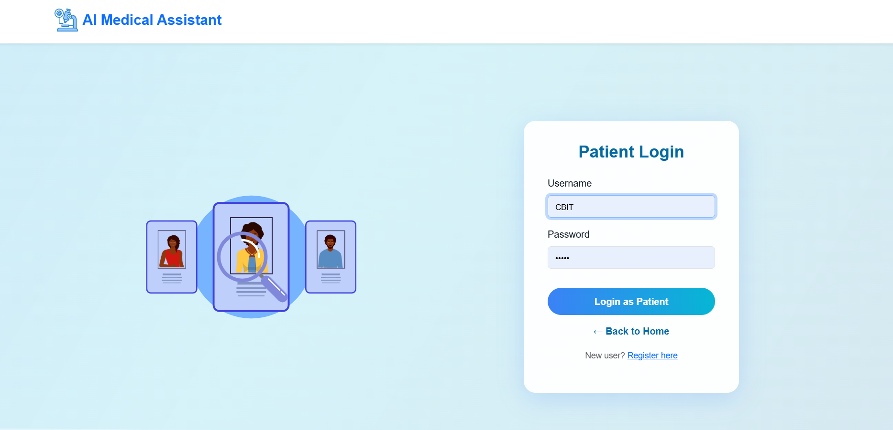
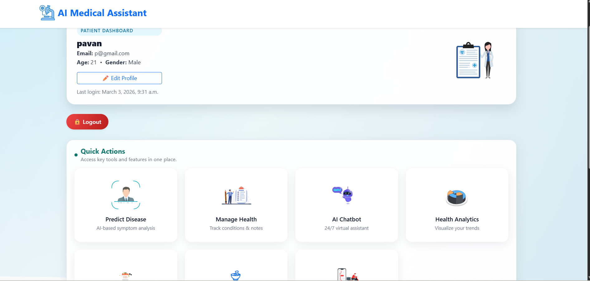
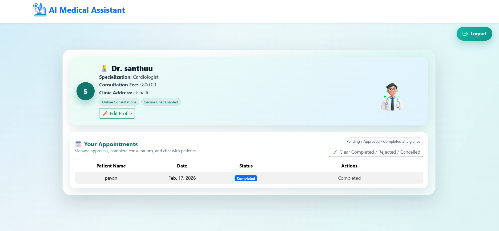
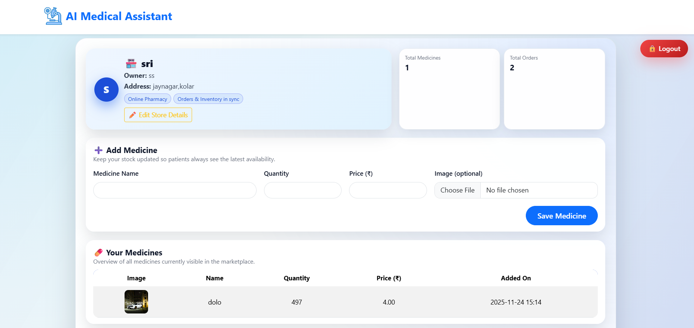
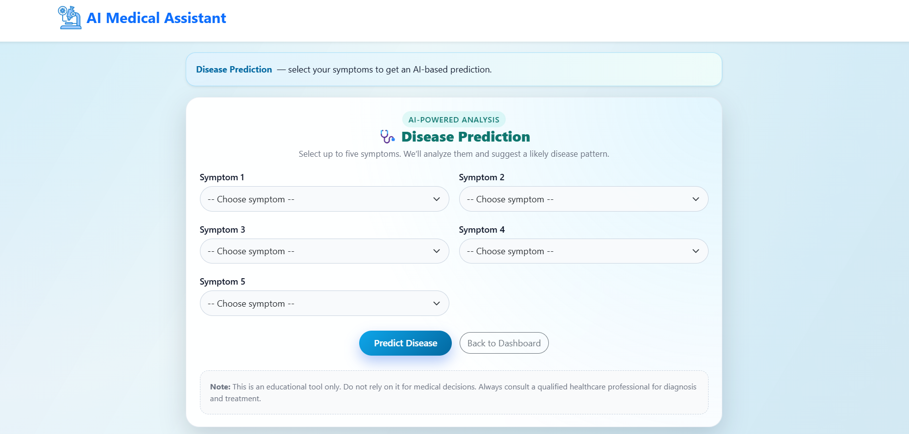
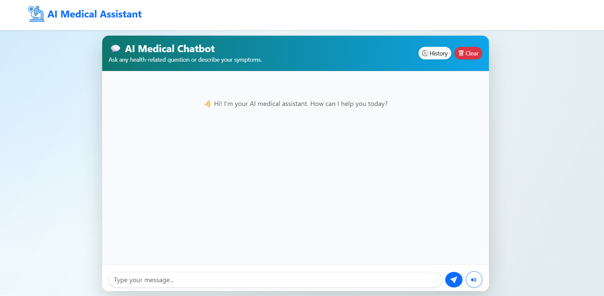
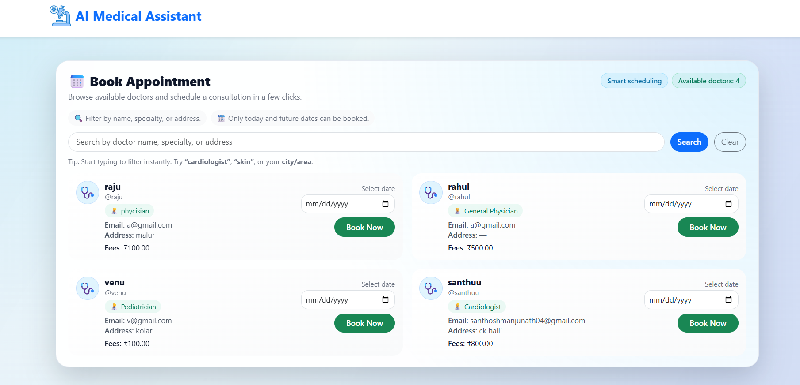

# AI Medical Assistant 🏥🤖

An AI-powered medical assistant web application built using Django and Machine Learning.

---
## ⭐ Support This Project

If you find this project useful, please consider giving it a star ⭐ on GitHub.  
It helps increase visibility and motivates me to build more projects!

👉 Click the ⭐ Star button at the top right of this repository.

## 🚀 Features
- Patient & Doctor authentication
- Disease prediction using ML
- Appointment booking
- Health analytics dashboard
- AI chatbot support
- Online Pharmacy support

---

## 🛠️ Tech Stack
- Python
- Django
- HTML, CSS, JavaScript
- Machine Learning (Tensorflow,keras)
- SQLite 

---

## 📂 Project Setup Instructions
### 1️⃣ Create virtual environment:
   - python -m venv venv

### 2️⃣  Activate it:
- Windows:
   - venv\Scripts\activate
- Mac / Linux:
   - source venv/bin/activate

### 3️⃣ Install dependencies:
- pip install -r requirements.txt

 ### 4️⃣ Add .env file in your project root
#### put:
```env

HF_AUTH_TOKEN="Your secret key generated for ai chatbot from hugging face"
```
### 5️⃣ Apply migrations:
- python manage.py makemigrations
- python manage.py migrate

### 6️⃣ Create superuser:
- python manage.py createsuperuser

### 7️⃣ Run the server:
- python manage.py runserver

### 8️⃣ Open in browser
```
http://127.0.0.1:8000/
```
---
### Clone the repository
```bash
git clone https://github.com/santhoshm0731-ui/AI-medical-assist.git
cd https://github.com/santhoshm0731-ui/AI-medical-assist.git
```
## 📸 Demo Screenshots

### 🏠 Home Page


### 🔐 Signup Page


### 🔐 Login Page


### 📊 Patient Dashboard


### 📊 Doctor Dashboard


### 🏥 Pharmacy Dashboard


### 🧠 Disease Prediction


### 🤖 AI Chatbot


### 📊 Appointments


# Important notes (If You want Online Chatbot)
- #### create folder called models in project root 
- #### store your models there(eg. DialoGPt-small from hugging face)


